# AI Startup Website

## 🚀 First DevOps Project

This project simulates the collaborative workflow of two DevOps engineers — **Tom** and **Jerry**. It walks through essential Git operations including creating a GitHub repository, cloning, branching, updating code, staging, committing, and pushing changes to the remote repository.

---

## 🛠️ Setup

### Git Installed and Running

The system is verified to have Git installed and operational.

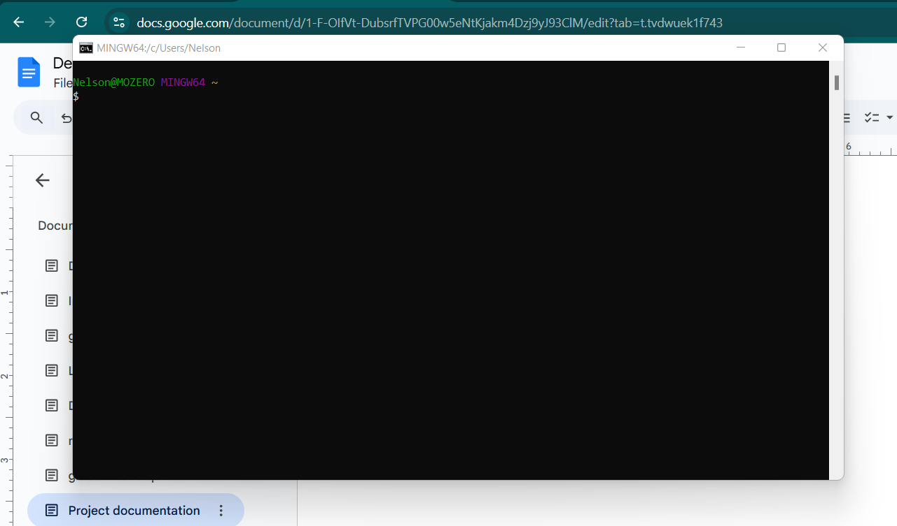

---

## 📁 Repository Initialization

### Creating the GitHub Repository

A new GitHub repository was created for the project.

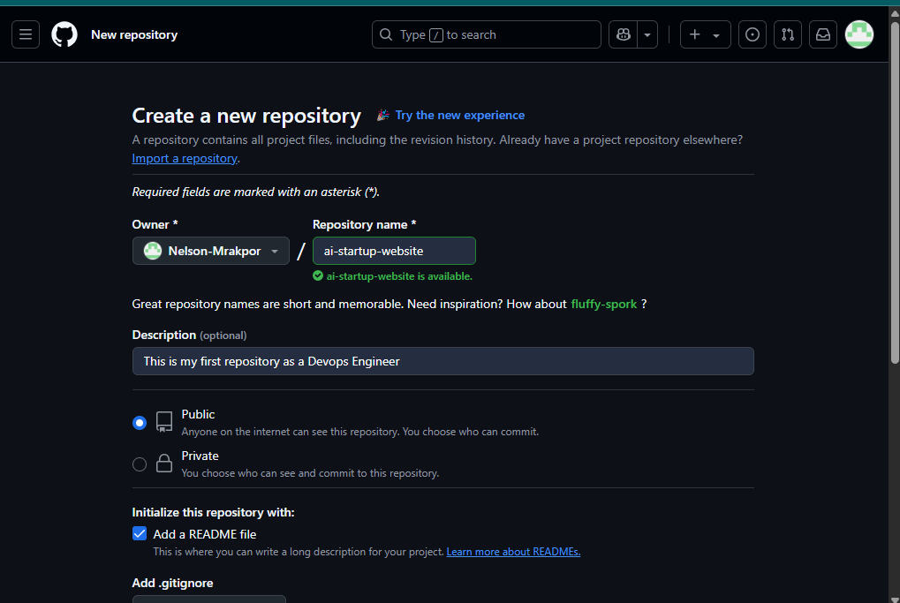

### Cloning the Repository Using Git Bash

The repository was cloned to the local machine via Git Bash.

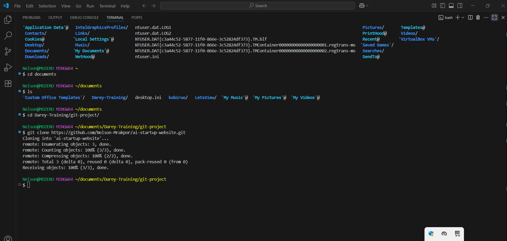

---

## 🌿 Main Branch Workflow

### Creating an `index.html` File

An `index.html` file was created under the `main` branch.

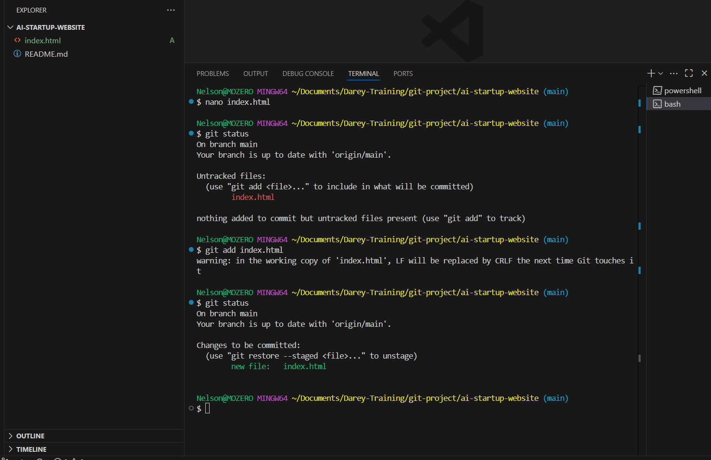

### First Commit and Push

The content of `index.html` was staged, committed, and pushed to GitHub.

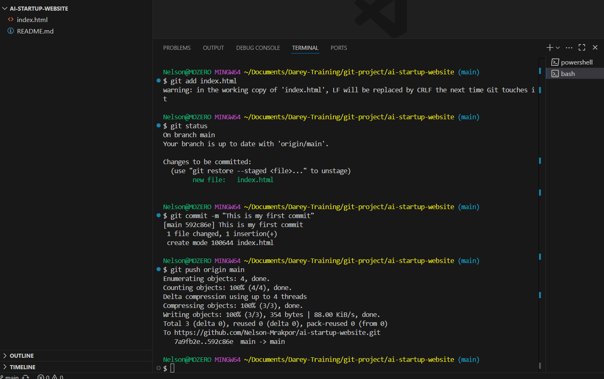

**Result on GitHub:**

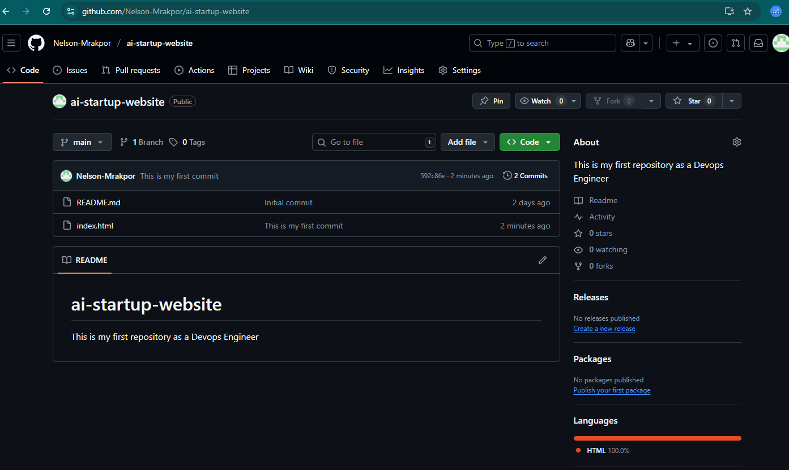

---

## 🧑‍💻 Tom's Branch Workflow

### Creating the `tom` Branch

A new branch `tom` was created for adding a navigation bar.

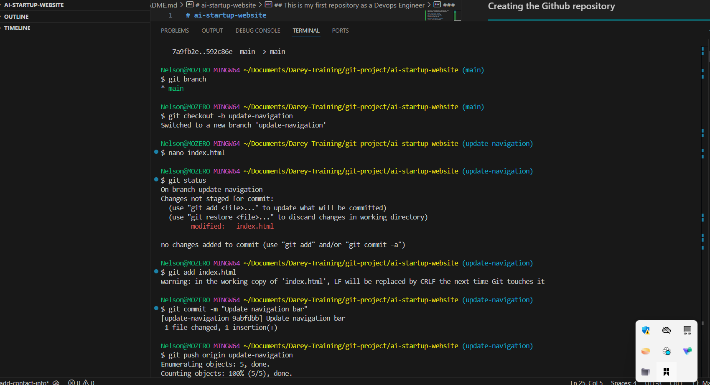

### Updating the Navigation Bar

Tom updated the navigation section of the website.

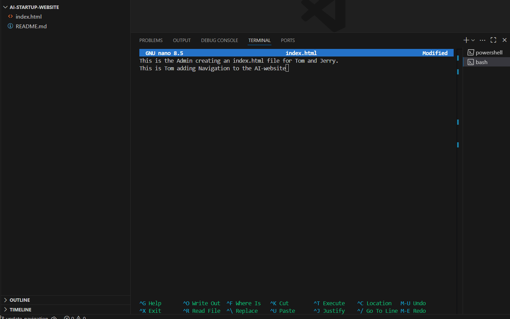

### Commit and Push

Changes were staged, committed, and pushed to GitHub.

**Result on GitHub:**

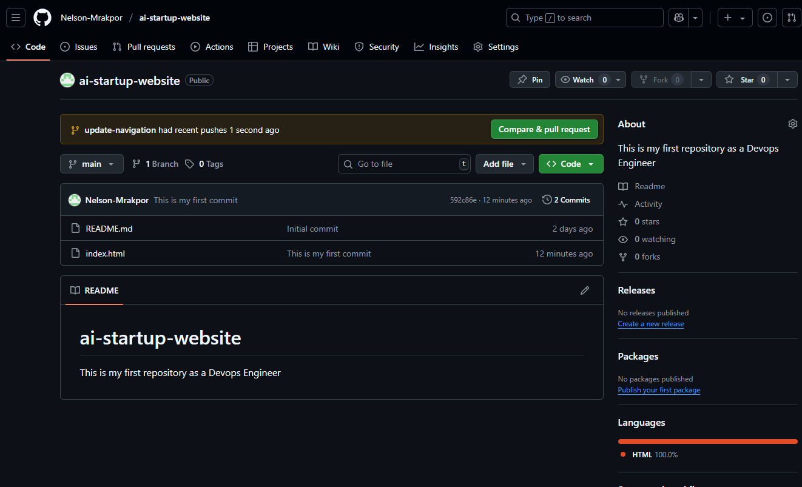

---

## 🧑‍💻 Jerry's Branch Workflow

### Creating the `jerry` Branch

Once Tom's changes were successfully merged, a new branch `jerry` was created to add contact information.

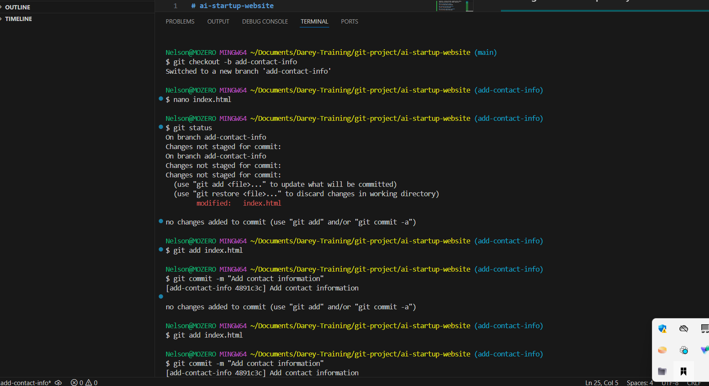

### Updating Contact Information

Jerry added contact details to the project.

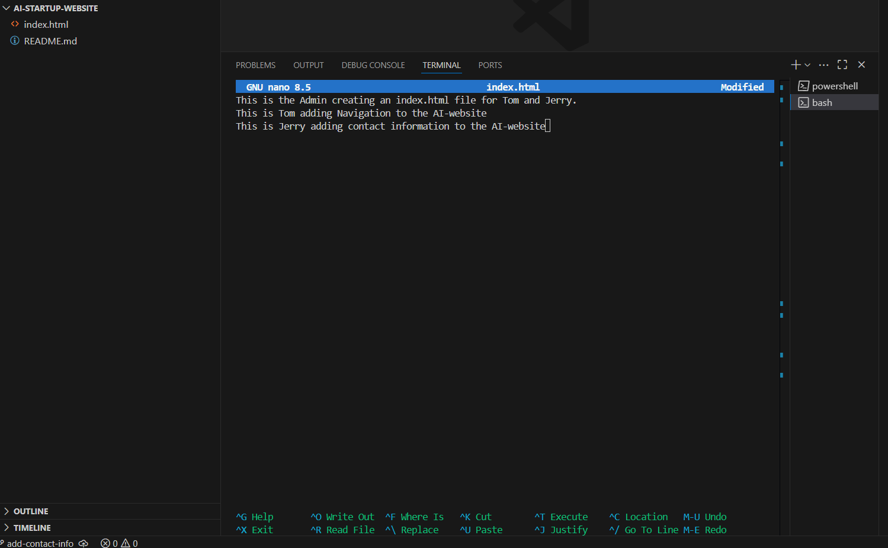

### Commit and Push

Jerry's changes were also staged, committed, and pushed.

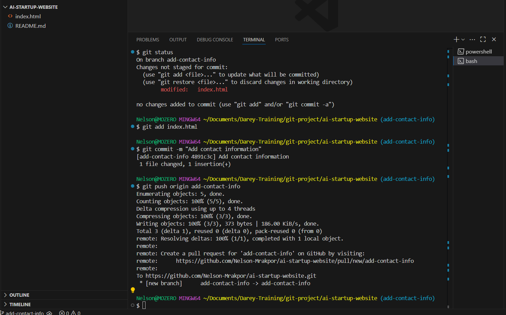

**Result on GitHub:**

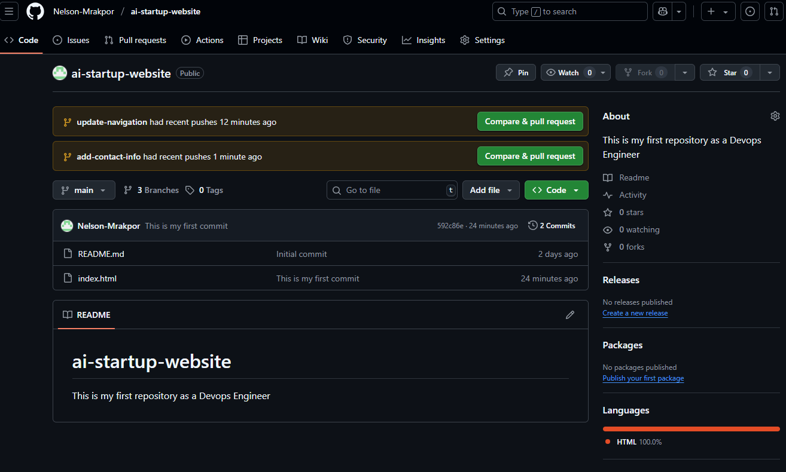

---

## ✅ Summary

This project demonstrates a collaborative Git workflow using branches, commits, and GitHub to manage contributions in a team setting — all through the lens of two fictional DevOps engineers. It reinforces the importance of version control, teamwork, and best practices in DevOps environments.

# AI startup project continued...
## Merging Tom and Jerry's changes
---

### Tom's Pull and Merge.
On Tom's branch in github a pull request was made to pull up Tom's changes for review.

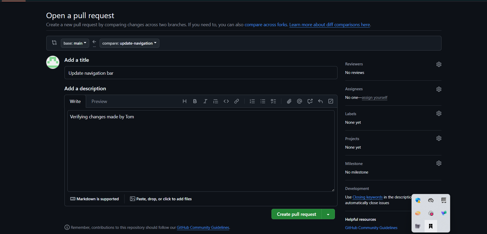

Once the necessary changes have been made a merge was initiated and confirmed.

Now with a sucessful merge it is time to review Jerry's changes.

---

### Updating main branch in local directory
A pull request was made from the main branch in vscode to ensure all changes are synchronized.

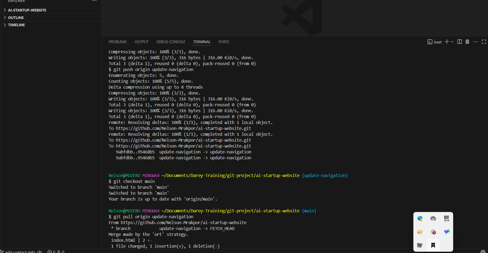

Once the merge have been pull and verified there are no conflicts, a push from Jerry's branch was initiated.

---

### Updating remote repository with changes

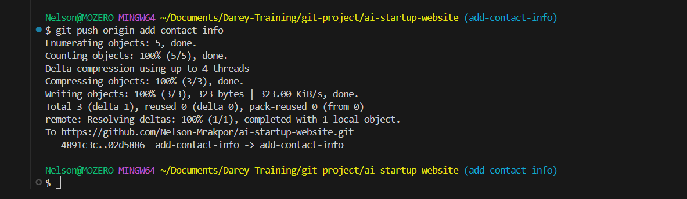

On Jerry's branch in github a pull request was made to pull up Jerry's changes for review.

---

### Jerry's Pull and Merge

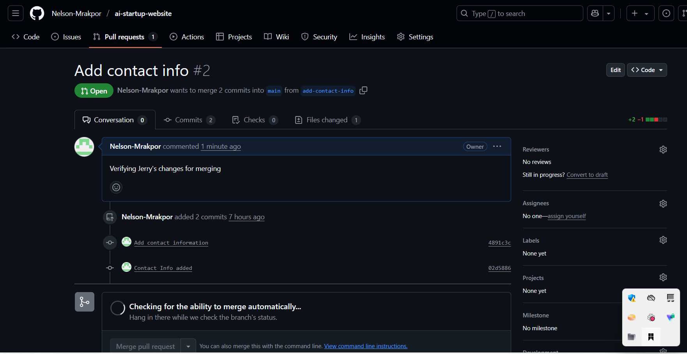

After Review and necessary changes made a merge was initiated and confirmed

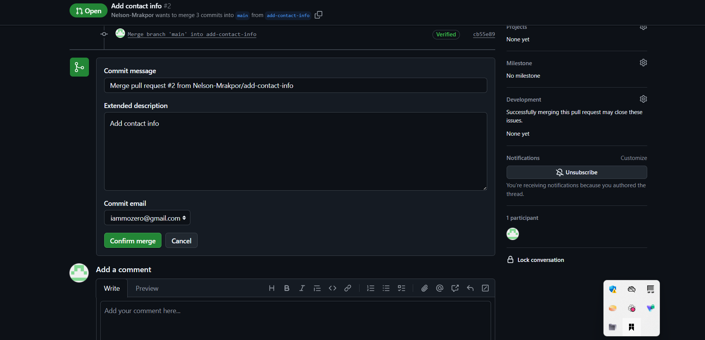

---

## Summary

This project demonstrates how team members collaborate on common projects demonstrating Git workflow using pull requests, and merges reinforcing the importance of version control system in the day to day activities of DevOps Engineers.