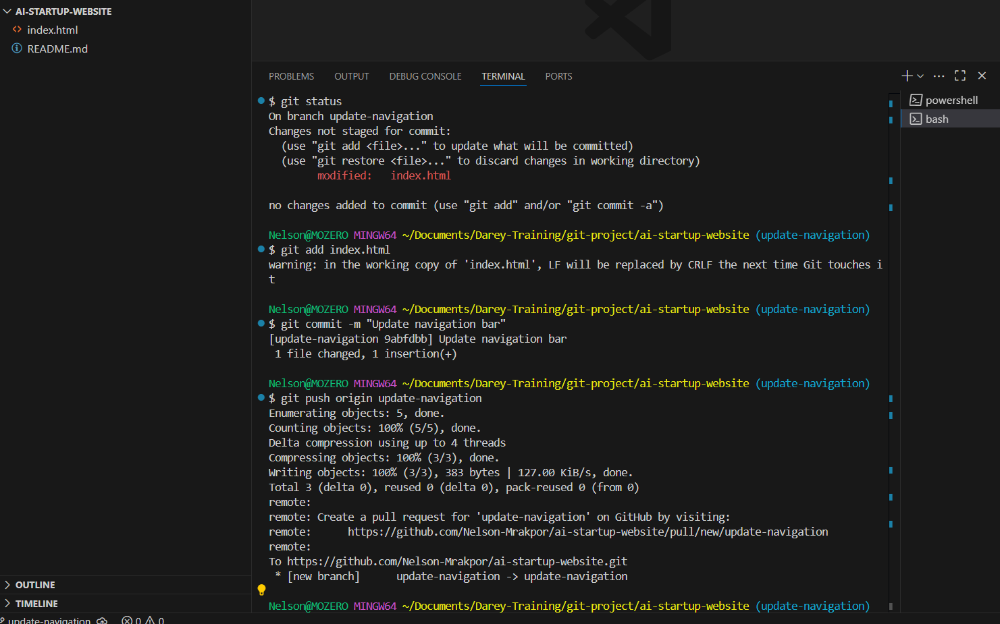

# AI Startup Website

## 🚀 First DevOps Project

This project simulates the collaborative workflow of two DevOps engineers — **Tom** and **Jerry**. It walks through essential Git operations including creating a GitHub repository, cloning, branching, updating code, staging, committing, and pushing changes to the remote repository.

---

## 🛠️ Setup

### Git Installed and Running

The system is verified to have Git installed and operational.

---

## 📁 Repository Initialization

### Creating the GitHub Repository

A new GitHub repository was created for the project.

### Cloning the Repository Using Git Bash

The repository was cloned to the local machine via Git Bash.

---

## 🌿 Main Branch Workflow

### Creating an `index.html` File

An `index.html` file was created under the `main` branch.

### First Commit and Push

The content of `index.html` was staged, committed, and pushed to GitHub.

**Result on GitHub:**

---

## 🧑‍💻 Tom's Branch Workflow

### Creating the `tom` Branch

A new branch `tom` was created for adding a navigation bar.

### Updating the Navigation Bar

Tom updated the navigation section of the website.

### Commit and Push

Changes were staged, committed, and pushed to GitHub.

**Result on GitHub:**

---

## 🧑‍💻 Jerry's Branch Workflow

### Creating the `jerry` Branch

Once Tom's changes were successfully merged, a new branch `jerry` was created to add contact information.

### Updating Contact Information

Jerry added contact details to the project.

### Commit and Push

Jerry's changes were also staged, committed, and pushed.

**Result on GitHub:**

---

## ✅ Summary

This project demonstrates a collaborative Git workflow using branches, commits, and GitHub to manage contributions in a team setting — all through the lens of two fictional DevOps engineers. It reinforces the importance of version control, teamwork, and best practices in DevOps environments.

